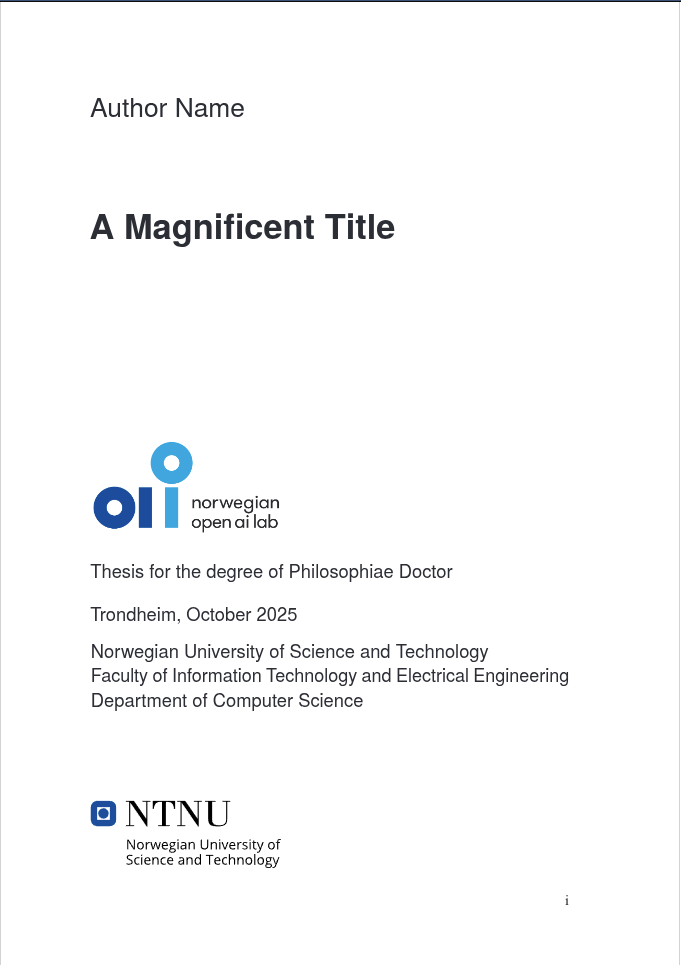

# PhD thesis template &ndash; Norwegian Open AI Lab

  
  

Yet another template for your PhD Thesis, with NAIL's logo on the cover page and a few other aesthetic enhancements 😁

## Credits and alternative templates

This template is based on [Bart's Unofficial NTNU Thesis Template](https://github.com/bartvbl/Unofficial-NTNU-Thesis-Template), which was mainly based on an old template from [Martin Helsø at UiO](https://github.com/uio-latex/phduio-article-based).

I also took some inspiration from the cover page of [NTNU's HPC-Lab Thesis Template](https://github.com/NTNU-HPC-Lab/NTNU-hpclab-thesis).

You should definitely check out all the templates at [Overleaf](https://www.overleaf.com/latex/templates?q=ntnu), including the one that _almost everyone_ use from [CoPCSE](https://github.com/COPCSE-NTNU/thesis-NTNU), as well as the one by [Bjørn Magnus](https://github.com/epichub/ntnu-phd-thesis-template) (which folk at NorwAI tend to use).

## Why should I use this template?

This template is, as all the others listed above, just a starting point.
You might (and ultimately will) end up with your own version after all the adjustments.
That is precisely what I liked about Bart's template—it is a very _verbose_ template, where you manually specify what you want, with very few additions and overheads on top of the content.
In general, this ends up being a bit more extensive but producing—in my opinion—cleaner results.

### Key differences with other templates

- Uses an updated (2025) version of NTNU's logo
- The font is slightly larger
- The margins are wider than Bjørn Magnus's, but narrower than Bart's (after Bart's suggestion!)
    - Bart's: `\setlrmarginsandblock{20mm}{28.7mm}{*}`
    - Our setting: `\setlrmarginsandblock{23mm}{28.7mm}{*}`
    - Bjørn Magnus's: `\setlrmarginsandblock{25mm}{28.7mm}{*}`
- Titles are typeset in sans serif
- As opposed to Bart's, this template includes thumbs for each publication (like Bjørn Magnus's)
- Thumbs are thinner (0.5cm down from 1cm)
- Thumbs use Roman numerals
- Similar to Bart's and Bjørn Magnus's templates, papers are included in `.tex` format. You typeset them in a B5 paper, as opposed to _embbeding_ the PDFs directly (as in CoPCSE's).
- As opposed to Bjørn Magnus's template, you are in charge of adapting the content and layout of the papers (instead of copy/pasting your old `.tex` files and switching between compilation modes)
- Use multiple `.bib` files

### Updated packages

- Replaced the ancient `algorithm2e` for the newer (and easier to use) `algpseudocodex` package
- `mathptm` is deprecated, and we use `newtx` instead
